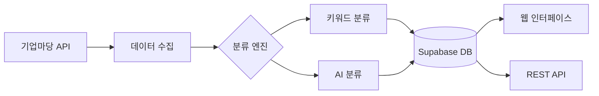

# 🏛️ 정부지원사업 경남 특화 시스템

[](https://python.org)
[](https://flask.palletsprojects.com)
[](https://supabase.com)
[](https://vercel.com)

**경상남도 정부지원사업**을 **21개 지역으로 자동 분류**하는 AI 기반 웹 애플리케이션입니다.

## ✨ 주요 특징

- 🎯 **경남 특화**: 21개 지역 분류 시스템 (전국 + 경남 + 18개 시군 + 기타)
- 🤖 **AI 분류**: Gemini API + 키워드 기반 이중 분류
- 🚀 **클라우드**: Supabase + Vercel 완전 관리형 서비스
- 📊 **실시간**: 기업마당 API 연동 자동 데이터 수집
- 💻 **웹 대시보드**: 관리자 인터페이스와 API 제공

## 🗺️ 21개 지역 분류 체계

| 구분 | 지역명 | 코드 | 설명 |
|------|--------|------|------|
| **전국** | 전국 | `ALL` | 중앙부처 전국 대상 사업 |
| **광역** | 경상남도 | `GYEONGNAM` | 경남 전체 대상 사업 |
| **기타** | 경남 이외 지역 | `OTHER` | 타 시도 대상 사업 |
| **시 지역** | 창원시, 진주시, 통영시, 사천시 | `GYEONGNAM_01~04` | 8개 시 |
| | 김해시, 밀양시, 거제시, 양산시 | `GYEONGNAM_05~08` |  |
| **군 지역** | 의령군, 함안군, 창녕군, 고성군 | `GYEONGNAM_09~12` | 10개 군 |
| | 남해군, 하동군, 산청군, 함양군 | `GYEONGNAM_13~16` |  |
| | 거창군, 합천군 | `GYEONGNAM_17~18` |  |

## 🚀 빠른 시작

### 📁 설치 가이드
**초보자**는 상세한 [📖 설치 가이드 (INSTALL.md)](./INSTALL.md)를 참고하세요.

### ⚡ 빠른 배포 (경험자용)

1. **저장소 복제**
```bash
git clone [저장소 URL]
cd government_support_system
```

2. **Supabase 설정**
- [supabase.com](https://supabase.com)에서 프로젝트 생성
- `gyeongnam_schema.sql` 실행하여 스키마 생성

3. **환경변수 설정**
```bash
cp .env .env.local
# .env 파일에 Supabase 연결 정보 입력
```

4. **Vercel 배포**
```bash
npm install -g vercel
vercel
# 환경변수 설정 후 재배포
vercel --prod
```

## 🏗️ 시스템 구조



### 🛠️ 기술 스택

| 구분 | 기술 | 용도 |
|------|------|------|
| **백엔드** | Python Flask | 웹 애플리케이션 프레임워크 |
| **데이터베이스** | Supabase PostgreSQL | 클라우드 데이터베이스 |
| **배포** | Vercel | 서버리스 배포 플랫폼 |
| **AI** | Google Gemini API | 지능형 지역 분류 |
| **데이터** | 기업마당 API | 정부지원사업 데이터 소스 |

## 📊 분류 알고리즘

### 🎯 2단계 분류 프로세스

1. **1차 키워드 분류** (신뢰도 90%+)
   - 공고명, 소관기관명 키워드 매칭
   - 경남 지역 특화 키워드 데이터베이스
   - 빠른 속도, 높은 정확도

2. **2차 AI 분류** (신뢰도 85%+)
   - Google Gemini API 활용
   - 문맥 기반 지능형 분석
   - 복잡한 케이스 처리

### 📈 분류 성능
- **전체 정확도**: ~88% (경남 지역 특화)
- **처리 속도**: 1초당 10개 공고
- **일일 처리량**: 1,000개+ 공고

## 🖥️ 사용법

### 🌐 웹 인터페이스
- **사용자 페이지**: 지역별 공고 검색 및 조회
- **관리자 대시보드**: 분류 현황 모니터링, 수동 분류

### 🔗 API 엔드포인트

```http
# 전체 공고 조회
GET /api/announcements

# 특정 지역 공고 조회  
GET /api/announcements?region=GYEONGNAM_01

# 시스템 상태 확인
GET /health

# 관리자 기능
POST /admin/collect    # 수동 데이터 수집
POST /admin/classify   # 수동 분류
```

### 💻 Python 코드 예제

```python
from app.services.gyeongnam_classifier import GyeongnamRegionClassifier

# 분류기 초기화
classifier = GyeongnamRegionClassifier()

# 공고 분류
announcement = {
    'pblancNm': '창원시 스마트팩토리 지원사업',
    'jrsdInsttNm': '창원시청'
}

result = classifier.classify_announcement(announcement)
print(f"지역: {result.region_name}")      # 창원시
print(f"코드: {result.region_code}")      # GYEONGNAM_01  
print(f"신뢰도: {result.confidence}")     # 0.95
```

## 📁 프로젝트 구조

```
government_support_system/
├── 📄 README.md                    # 프로젝트 소개
├── 📄 INSTALL.md                   # 설치 가이드
├── 📄 CLAUDE.md                    # 시스템 문서  
├── 📄 requirements.txt             # Python 의존성
├── 📄 vercel.json                  # Vercel 배포 설정
├── 📄 gyeongnam_schema.sql         # 데이터베이스 스키마
├── 📄 app.py                       # Flask 메인 앱
├── 📁 app/
│   ├── 📁 models/                  # 데이터베이스 모델
│   ├── 📁 services/                # 비즈니스 로직
│   │   ├── gyeongnam_classifier.py     # 경남 분류기
│   │   ├── gyeongnam_region_service.py # 지역 서비스
│   │   ├── data_collector.py           # 데이터 수집
│   │   └── ...
│   ├── 📁 templates/               # HTML 템플릿
│   └── 📁 static/                  # CSS, JS 파일
└── 📁 config/                      # 설정 파일
    └── database.py                 # DB 연결 설정
```

## 🔧 개발 환경 설정

### 요구사항
- Python 3.9+
- Git
- 웹 브라우저

### 로컬 개발
```bash
# 1. 가상환경 생성
python -m venv venv
source venv/bin/activate  # Linux/macOS
venv\Scripts\activate     # Windows

# 2. 패키지 설치
pip install -r requirements.txt

# 3. 환경변수 설정
cp .env .env.local
# .env 파일 편집

# 4. 로컬 실행
python app.py
```

## 🔑 필요한 API 키

### 필수
- **기업마당 API**: [www.bizinfo.go.kr](https://www.bizinfo.go.kr)에서 발급
- **Supabase**: [supabase.com](https://supabase.com)에서 프로젝트 생성

### 선택사항  
- **Gemini API**: [aistudio.google.com](https://aistudio.google.com)에서 발급 (AI 분류용)

## 🐛 문제 해결

### 자주 발생하는 문제

**데이터베이스 연결 오류**
```bash
# Supabase 연결 정보 확인
python -c "from config.database import test_database_connection; test_database_connection()"
```

**API 키 인식 오류**
```bash
# 환경변수 확인
python -c "import os; print(os.getenv('SUPABASE_HOST'))"
```

**Vercel 배포 실패**
```bash
# 로그 확인
vercel logs
```

## 📈 로드맵

- [ ] 🔄 실시간 분류 현황 대시보드
- [ ] 📱 모바일 앱 지원
- [ ] 🔔 알림 시스템 (새로운 공고 알림)
- [ ] 📊 분류 통계 및 분석 기능
- [ ] 🔍 고급 검색 필터
- [ ] 📧 이메일 구독 서비스

## 🤝 기여하기

1. 이 저장소를 포크하세요
2. 새 기능 브랜치를 만드세요 (`git checkout -b feature/amazing-feature`)
3. 변경사항을 커밋하세요 (`git commit -m 'Add amazing feature'`)
4. 브랜치에 푸시하세요 (`git push origin feature/amazing-feature`)
5. Pull Request를 만드세요

## 📄 라이선스

이 프로젝트는 [MIT License](LICENSE) 하에 배포됩니다.

## 🆘 지원

- 📝 **문서**: [INSTALL.md](./INSTALL.md), [CLAUDE.md](./CLAUDE.md)
- 🐛 **이슈 신고**: GitHub Issues
- 💬 **문의**: 이메일 또는 GitHub Discussions

---

<div align="center">

**🎯 개발 목표**: 경남 지역 정부지원사업의 효율적 분류 및 정보 제공  
**📊 목표 정확도**: 전체 88% 이상 (경남 지역 특화)  
**⚡ 처리 성능**: 일 1,000개+ 공고 자동 분류

Made with ❤️ for 경상남도

</div>